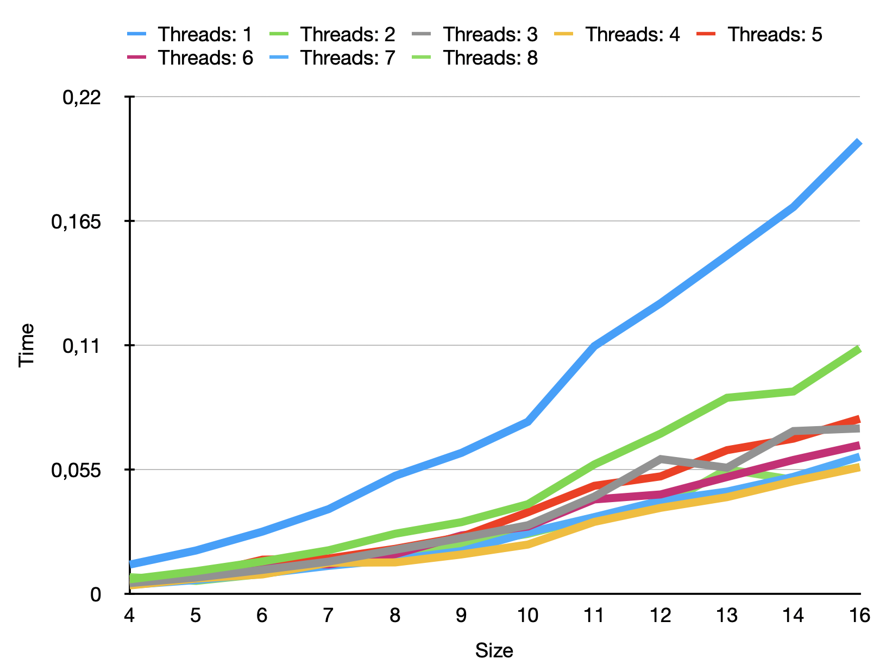

# Final Exam

This program solves a two dimensional heat equation over multiple time steps and is parallelized with OpenMPI.

The input is a qr code, which gets scaled based on input parameters to intensify the computation.
Depending on the number of threads, the input is split up and parts are computed in each thread.
After each thread, the borders are exchanged via `MPI_Send` and `MPI_Recv`.
At the end, the partial results are collected in thread 0 and exported to an output directory.
In case of running the benchmark, the image export is skipped and a `.csv` file is written instead. 

## Setup

### Dependencies

The program uses `libpng` and `open-mpi`, please install the dependencies and adjust include and linking paths in Makefile line 7.

### Create output directory

```bash
mkdir out
```

### Compile program

```bash
make
```

## Run

### Basic

Parameters can be customized at the top of the Makefile.

```bash
make run
```
### Benchmark

Will generate a `benchmark.csv` in the output directory for plotting and analysis.

```bash
make benchmark
```

## Result

On my machine these are the results:



The best performance was achieved with 4 threads.
The reason for this is my machine which has 4 performance and 4 efficiency cores with one thread each.
So spinning up threads on the efficiencies cores seriously harms the performance.
